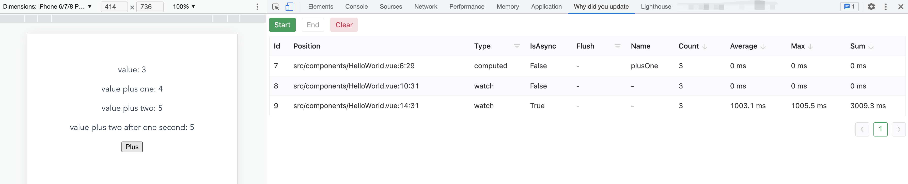

# Why did you update

Tools to help you improve performance of your Vue application.

## Usage

If we want to know how many times that (one of or all of) `watch` or `computed` has been updated or how long does they take. We can use `whyDidYouUpdate`.


For example, We have a [demo](./packages/babel-plugin-why-did-you-update/tests/demo) project. And the major component is:
```vue
<script setup lang="ts">
  import { watch, computed, ref } from "@vue/composition-api";

  const sleep = (n: number) => new Promise(resolve => setTimeout(resolve, n))

  const msg = ref(0);
  const plusOne = computed(() => {
    return msg.value + 1;
  });
  const plusTwo = ref(msg.value);
  watch(
    () => plusOne.value,
    (one) => {
      plusTwo.value = one + 1;
    }
  );
  const plusTwoAfterOneSecond = ref(msg.value);
  watch(
    () => plusOne.value,
    async (one) => {
      await sleep(1000)
      plusTwoAfterOneSecond.value = one + 1;
    }
  );
</script>
<template>
  <div class="hello">
    <p>value: {{ msg }}</p>
    <p>value plus one: {{ plusOne }}</p>
    <p>value plus two: {{ plusTwo }}</p>
    <p>value plus two after one second: {{ plusTwoAfterOneSecond }}</p>
    <button @click="msg++">Plus</button>
  </div>
</template>
```

If we click `Plus` button a few times, we can see the result:



## Install

1. `yarn add babel-plugin-why-did-you-update`.
2. add `why-did-you-update` to your babel config file.
```js
// babel.config.js
module.exports = {
  presets: ["@vue/cli-plugin-babel/preset"],
  plugins: ["why-did-you-update"],
};
```
3. Unzip extension and [load it in Chrome](https://developer.chrome.com/docs/extensions/mv3/getstarted/#unpacked). 
4. Build or serve your project.
5. Open your project with Chrome.
6. Open `why did you update` tab in Chrome devtools.
7. Click `Start`
8. Do something in your page.
9. Click `Stop`.
10. Here we go.